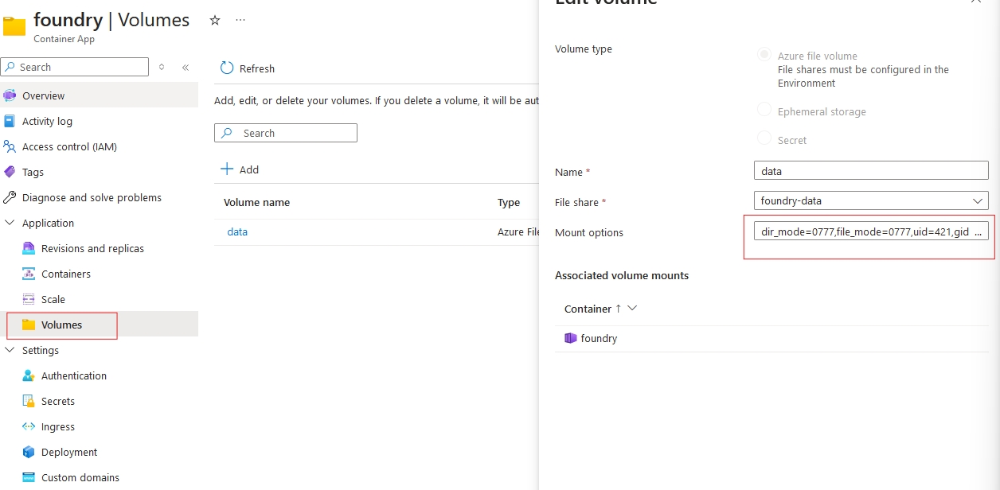

# Foundrt TTS Azure deployment

This code deploys Foundry VTT on Azure using Terraform.

The main branch uses [Azure Container Apps](https://azure.microsoft.com/fr-fr/products/container-apps/) to deploy Foundry VTT in a serverless manner.


## Deploy

You must have an active Azure Subscription. 
Create "creds.tfvars" file with

```env
# Foundry VTT account url, this is 
foundry_username =
foundry_password =
foundry_hostname =
foundry_admin_password =
```

Then exec :
```sh
terraform apply -var-file="creds.tfvars"
```

## Hotfix mount options

At this time, it seems that Terraform doesn't support the mount options for an Azure File share mounted on an Azure Container App.
To fix this, you can manually add the following mount options to the `foundry` container app in the Azure Portal:

Go to the Azure Portal, then to the `foundry` container app, then to the `Application` section in the sidebar, in the `Volumes` category.
Click on the `data` volume, then on the `Mount options` textbox add the following options:

    dir_mode=0777,file_mode=0777,uid=421,gid=421,mfsymlinks

Then click on the `Save` button.




